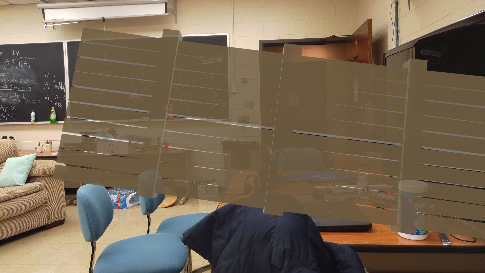

# Fitness Game

## Demo

[video](https://youtu.be/6FYQ-V4XmO0)

## Milestone

- [ ] Finalize touch detection and bound manipulation.
- [ ] Implement backend endpoint for submiting a sequence.
- [ ] Implement a backend endpoint for listing submitted sequences.
- [ ] Implement a backend endpoint for match making room.
- [ ] Implement a backend endpoint for websocket relay.
- [ ] Implement basic account system.

## Concepts

### Wall

Representing a surface the user is interacting with to generate or response to the sequence.

### Sequence

Representing the list of location that the user tapped. It can also be representing a location
that user is supposed to tap.

Sequence can be near real-time or pre-recorded.

### User / Account

Representing an ownership to sequence(s).

### Concept to focus

- User identification in AR/VR application.
- Concept of user action that affect other AR/VR environment across network.

## Design

(copied from the Projects.md)

One sentence summary: Tapping on series of circles appearing on the wall - the game.

### Use Cases (single player / non-realtime gameplay)

**Core setup**

- player can place a wall down anywhere in the environment

**Core gameplay**

- player can select which series of circles they want to attempt
- player complete a series of circle appearing on the wall
- system keep track of the scores by how much time has passed since the circle appear and the user interact with it
- system can display the score

**Series Generation**

- player can tap on the wall to start recording the series of circles
- player can name the series and upload it for other player to attempt

### Use Cases (multi-player/ realtime gameplay)

**Core setup**

- user can place a wall anywhere in the environment
- user start the match making
- user can vote on how long the sequence is for each turn
- user can vote on how many turn the game will be

**Core gameplay**

- player take turn creating a series
- player can response to the series create by the other player
- system keep track of the score
- system select the winner base on accumulation of the scores over all the turns

**Challenge Use Cases**

- player can create account to associate their creation to the account and keep track of the score
- system can log user in without them having to type in their credentials (QR code recognition from companion application? hands gesture recognition? magic wand movement login?)

## Current Roadblock

- Tapping on the "wall" does not create the event we is expecting.

## Assets Contribution

- Wooden Wall byQuaternius https://poly.pizza/m/8C9NBoi9cA

## Note

### How hands control work in emulator? 

See how to control hands and movement in the emulator at https://stereokit.net/Pages/Guides/Using-The-Simulator.html

## Which axis is forward in StereoKit?

- Forward: -Z
- Right: +X
- Up: +Y
- Floor Plane: XZ
- RGB = XYZ

From https://stereokit.net/Pages/StereoKit/Lines/AddAxis.html

> Displays an RGB/XYZ axis widget at the pose! Each line is extended along the positive direction of each axis, so the red line is +X,
> green is +Y, and blue is +Z. A white line is drawn along -Z to indicate the Forward vector of the pose (-Z is forward in StereoKit).\
